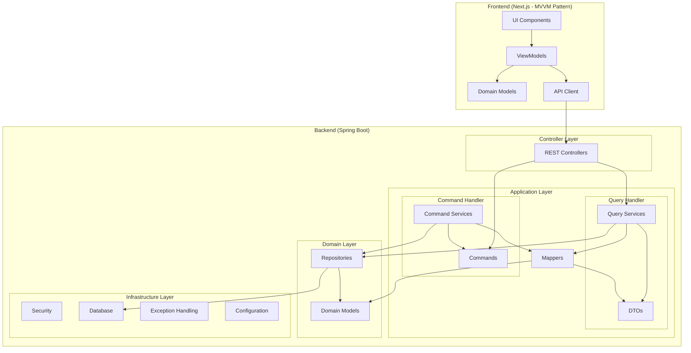

# Invoicing System Architecture Diagram

## CQRS Pattern Implementation

The architecture implements Command Query Responsibility Segregation (CQRS) pattern, separating the command (write) operations from query (read) operations:

### Command Flow
1. Client sends a command to the API (e.g., CreateInvoiceCommand)
2. Controller receives and validates the command
3. Command is passed to the appropriate service
4. Service processes the command, updates domain models
5. Changes are persisted via repositories

### Query Flow
1. Client requests data from the API
2. Controller receives the request
3. Query is passed to the appropriate service
4. Service retrieves data via repositories
5. Mappers transform domain models to DTOs
6. DTOs are returned to the client

## Vertical Slice Architecture

Each feature is implemented as a vertical slice through all layers of the application:

- Client Management Feature
- Invoice Management Feature
- Authentication Feature
- User Management Feature

## Domain-Driven Design

The domain models are the core of the application, with rich behavior and business rules:

- Aggregates: Invoice, Client, User
- Value Objects: InvoiceStatus, InvoiceNumber
- Domain Events: InvoiceCreated, InvoiceUpdated, InvoicePaid

## Frontend MVVM Pattern

The frontend implements the Model-View-ViewModel pattern:

- **Model**: Domain objects representing the business data
- **View**: UI components for user interaction
- **ViewModel**: Mediators between Model and View, containing presentation logic

This architecture provides clean separation of concerns, improved testability, and scalability.
